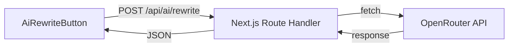

# Assistente IA para Textos — Design

**Spec**: `.specs/features/ai-text-assistant/spec.md`
**Status**: Approved

---

## Architecture Overview

API route Next.js chama OpenRouter (compatível com OpenAI API) com modelo gratuito `google/gemma-4-31b-it:free`. Componente `<AiRewriteButton>` reutilizável é colocado ao lado de qualquer `<Textarea>` ou `<Input>` que precise de reescrita.



---

## Code Reuse Analysis

### Existing Components to Leverage

| Component | Location | How to Use |
|-----------|----------|------------|
| Textarea | `src/components/ui/textarea` | Campos que recebem o botão IA |
| Button | `src/components/ui/button` | Base do botão de reescrita |
| toast (sonner) | `sonner` | Feedback de sucesso/erro |
| env validation | `src/env.js` | Adicionar OPENROUTER_API_KEY |
| tRPC router pattern | `src/server/api/routers/` | Não usar — API route é mais simples para streaming futuro |

### Integration Points

| System | Integration Method |
|--------|--------------------|
| OpenRouter | fetch nativo para `https://openrouter.ai/api/v1/chat/completions` |
| env.js | Nova var `OPENROUTER_API_KEY` |

---

## Components

### AiRewriteButton

- **Purpose**: Botão reutilizável que envia texto para reescrita pela IA e retorna resultado
- **Location**: `src/components/ai/ai-rewrite-button.tsx`
- **Props**:
  ```typescript
  interface AiRewriteButtonProps {
    value: string;
    onRewrite: (rewrittenText: string) => void;
    minLength?: number;
    variant?: "description" | "title" | "bio";
    disabled?: boolean;
  }
  ```
- **Dependencies**: Button, Loader2, Sparkles icons, toast
- **Reuses**: shadcn Button pattern

### /api/ai/rewrite Route Handler

- **Purpose**: Endpoint server-side que chama OpenRouter API, nunca expõe a API key ao client
- **Location**: `src/app/api/ai/rewrite/route.ts`
- **Interfaces**:
  - `POST { text: string, variant: "description" | "title" | "bio" }` → `{ text: string }`
- **Dependencies**: env.OPENROUTER_API_KEY
- **Reuses**: env validation pattern from `src/env.js`

---

## Data Models

Nenhum modelo novo. A IA é stateless — recebe texto, retorna texto reescrito.

---

## Error Handling Strategy

| Error Scenario | Handling | User Impact |
|----------------|----------|-------------|
| API key não configurada | Route retorna 500 com mensagem clara | Toast "IA não configurada" |
| OpenRouter retorna erro (rate limit, etc) | Route retorna 502 | Toast "Erro ao processar. Tente novamente." |
| Timeout (>30s) | AbortController no fetch | Toast "Tempo esgotado. Tente novamente." |
| Texto vazio/muito curto | Validação no client antes de enviar | Toast "Texto muito curto para melhorar" |
| Erro de rede | catch no fetch | Toast genérico de erro |

---

## Tech Decisions

| Decision | Choice | Rationale |
|----------|--------|-----------|
| API Route vs tRPC | API Route (Next.js Route Handler) | Mais simples para chamadas externas, não precisa de invalidação de cache, facilita streaming futuro |
| Modelo | `google/gemma-4-31b-it:free` | Gratuito, boa qualidade para texto em PT-BR, 262K contexto |
| SDK vs fetch nativo | fetch nativo | Zero dependências novas, OpenRouter é compatível com OpenAI API |
| Componente vs Hook | Componente `<AiRewriteButton>` | Encapsula UI + lógica, reutilizável em qualquer campo |
| Estado de "desfazer" | No componente pai via ref `previousText` | Pai controla o texto, botão apenas aciona callback |

---

## System Prompt

```
Você é um assistente de redação para agrônomos. Reescreva o texto a seguir de forma profissional, clara e bem estruturada, adequada para um relatório técnico agronômico.

Regras:
- Mantenha TODAS as informações técnicas do texto original
- Use linguagem formal e profissional
- Corrija gramática e pontuação
- Melhore a estrutura e clareza
- NÃO invente informações que não estavam no original
- NÃO remova números, medidas ou dados específicos
- Responda APENAS com o texto reescrito, sem explicações ou comentários
```
