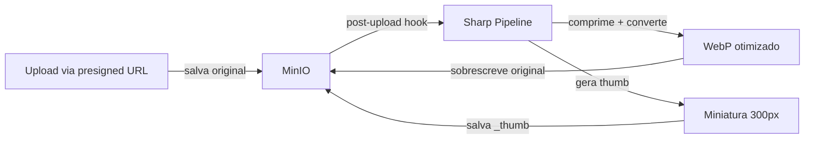

# Otimização Inteligente de Imagens — Design

**Spec**: `.specs/features/image-optimization/spec.md`
**Status**: Approved

---

## Architecture Overview

Pipeline de processamento no backend usando Sharp. Quando o agrônomo faz upload via presigned URL, a imagem vai direto pro MinIO. Depois, um hook tRPC post-upload processa a imagem: baixa do MinIO, comprime, redimensiona, gera miniatura, e sobrescreve/salva as variantes.



---

## Code Reuse Analysis

### Existing Components to Leverage

| Component | Location | How to Use |
|-----------|----------|------------|
| MinIO client | `src/server/storage/minio.ts` | Download/re-upload das imagens |
| tRPC photo router | `src/server/api/routers/photo.ts` | Hook post-upload após presigned URL |
| Presigned URL flow | `photo.getUploadUrl` | Fluxo existente, sem mudança |

### Integration Points

| System | Integration Method |
|--------|--------------------|
| Sharp | `sharp` npm package |
| MinIO | Client S3 existente |

---

## Components

### src/server/storage/image-optimizer.ts

- **Purpose**: Pipeline de compressão, conversão e geração de miniaturas
- **Functions**:
  ```typescript
  // Otimiza imagem para WebP, max 2048px, quality 80
  optimizeImage(buffer: Buffer): Promise<Buffer>

  // Gera miniatura max 300px (quadrada se avatar)
  generateThumbnail(buffer: Buffer, purpose: "analysis" | "avatar"): Promise<Buffer>

  // Pipeline completo: download do MinIO → otimiza → re-upload
  processUploadedImage(objectKey: string, purpose: "analysis" | "avatar"): Promise<{
    optimizedKey: string;
    thumbnailKey: string;
    originalSize: number;
    optimizedSize: number;
  }>
  ```
- **Dependencies**: sharp, minio client

### Post-upload hook no photo router

- **Purpose**: Após confirmar upload da foto, dispara processamento assíncrono
- **Location**: `src/server/api/routers/photo.ts` — mutation `confirmUpload` (ou similar)
- **Behavior**: Confirma o upload pro client imediatamente, processa a imagem em background (não bloqueia o fluxo)

### Script de migração: scripts/optimize-existing-images.ts

- **Purpose**: Processa todas as imagens já cadastradas retroativamente
- **Location**: `scripts/optimize-existing-images.ts`
- **Run**: `npx tsx scripts/optimize-existing-images.ts`
- **Behavior**: Busca todas as fotos no banco, processa cada uma, loga progresso e economia total

---

## Data Models

### Mudança no schema

Adicionar colunas na tabela `analysisPhoto`:

```typescript
// src/server/db/schema.ts — analysisPhoto
thumbnailUrl: text("thumbnail_url"),     // URL da miniatura
optimizedAt: timestamp("optimized_at"),   // Quando foi otimizada
originalSize: integer("original_size"),   // Tamanho original em bytes
optimizedSize: integer("optimized_size"), // Tamanho otimizado em bytes
```

Tabela `client` — campo `photo`:
- Mesma lógica: adicionar `thumbnailUrl`, `optimizedAt`, `originalSize`, `optimizedSize`

---

## Processing Pipeline

```
1. Download imagem do MinIO (objectKey original)
2. Sharp: metadata → verifica se já é WebP < 500KB (skip se sim)
3. Sharp: resize(2048, null, { withoutEnlargement: true })
4. Sharp: webp({ quality: 80 })
5. Upload otimizado → mesmo objectKey (sobrescreve original)
6. Sharp: resize(300, purpose === "avatar" ? 300 : null)
7. Sharp: webp({ quality: 75 })
8. Upload thumbnail → objectKey + "_thumb" suffix
9. Atualizar banco com URLs e tamanhos
```

---

## Error Handling Strategy

| Error Scenario | Handling | User Impact |
|----------------|----------|-------------|
| Sharp falha (formato não suportado) | Log warning, manter original | Nenhum — imagem funciona normal, sem otimização |
| MinIO falha no re-upload | Log error, manter original | Nenhum — imagem funciona normal |
| Timeout no processamento (>10s por imagem) | Abortar, manter original | Nenhum |
| GIF animado | Pular processamento | GIF preservado intacto |

---

## Tech Decisions

| Decision | Choice | Rationale |
|----------|--------|-----------|
| Sharp vs ImageMagick | Sharp | Nativo Node.js, rápido, zero deps externas, suporta WebP |
| Sobrescrever original vs manter | Sobrescrever | Economia de storage imediata. Recuperar original não é requisito |
| Síncrono vs assíncrono | Assíncrono (fire-and-forget) | Não bloqueia o upload pro agrônomo |
| Miniatura path | Mesmo path + sufixo `_thumb` | Simples, previsível |
| Migração retroativa | Script standalone | Roda uma vez, fora da aplicação |
