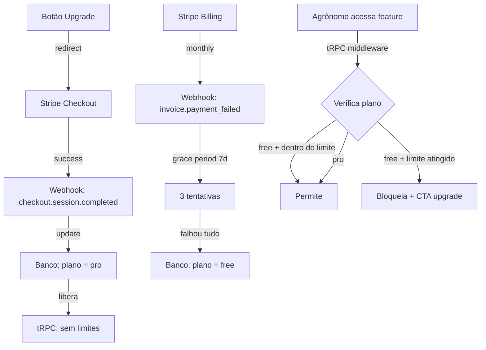

# Monetização — Design

**Spec**: `.specs/features/monetization/spec.md`
**Status**: Approved

---

## Architecture Overview

Stripe para cobrança recorrente. O plano do agrônomo é armazenado no banco (tabela `subscription`). Webhooks do Stripe atualizam o status da assinatura em tempo real. Middleware tRPC verifica limites do plano antes de permitir operações.



---

## Code Reuse Analysis

### Existing Components to Leverage

| Component | Location | How to Use |
|-----------|----------|------------|
| Better Auth user | `src/server/better-auth/` | Adicionar campos de plano no user |
| tRPC procedures | `src/server/api/trpc.ts` | Middleware de verificação de plano |
| Analysis router | `src/server/api/routers/analysis.ts` | Adicionar check de limite |
| Client router | `src/server/api/routers/client.ts` | Adicionar check de limite fazendas |
| MinIO client | `src/server/storage/minio.ts` | Upload de logo personalizada |
| toast (sonner) | `sonner` | Feedback de upgrade/limite |

### Integration Points

| System | Integration Method |
|--------|--------------------|
| Stripe | `stripe` npm package + webhooks |
| DNS/Subdomínio | Wildcard DNS + Next.js middleware de roteamento |
| Stripe CLI | Teste local de webhooks |

---

## Components

### src/server/db/schema.ts — Mudanças no schema

```typescript
// Tabela nova: subscription
export const subscription = pgTable("subscription", {
  id: text("id").primaryKey(),
  userId: text("user_id").references(() => user.id, { onDelete: "cascade" }),
  plan: text("plan", { enum: ["free", "pro"] }).notNull().default("free"),
  stripeCustomerId: text("stripe_customer_id"),
  stripeSubscriptionId: text("stripe_subscription_id"),
  stripePriceId: text("stripe_price_id"),
  status: text("status", { enum: ["active", "past_due", "canceled", "incomplete"] }).default("active"),
  currentPeriodEnd: timestamp("current_period_end"),
  canceledAt: timestamp("canceled_at"),
  createdAt: timestamp("created_at").defaultNow(),
  updatedAt: timestamp("updated_at").defaultNow(),
});

// Adicionar no user
subdomain: text("subdomain"),        // subdomínio personalizado
logoUrl: text("logo_url"),           // logo personalizada
```

### src/server/stripe/config.ts — Configuração Stripe

- **Purpose**: Inicialização do Stripe SDK e configuração de produtos/preços
- **Content**:
  ```typescript
  import Stripe from "stripe";

  export const stripe = new Stripe(process.env.STRIPE_SECRET_KEY!);

  export const PLANS = {
    free: { name: "Gratuito", maxReports: 3, maxFarms: 1 },
    pro: {
      name: "Profissional",
      priceId: process.env.STRIPE_PRO_PRICE_ID!,  // R$ 19,90/mês
      maxReports: Infinity,
      maxFarms: Infinity,
    },
  } as const;
  ```

### src/server/stripe/checkout.ts — Sessões de checkout

- **Purpose**: Criar sessão de checkout Stripe
- **Functions**:
  ```typescript
  // Cria checkout session para upgrade
  createCheckoutSession(userId: string, userEmail: string): Promise<string>

  // Cria portal de gerenciamento (cancelar, trocar cartão)
  createPortalSession(stripeCustomerId: string): Promise<string>
  ```

### src/app/api/stripe/webhook/route.ts — Webhook handler

- **Purpose**: Recebe eventos do Stripe e atualiza o banco
- **Events tratados**:
  - `checkout.session.completed` → plano = pro
  - `customer.subscription.updated` → atualizar status
  - `customer.subscription.deleted` → plano = free
  - `invoice.payment_failed` → status = past_due
- **Security**: Verifica assinatura do webhook com `stripe.webhooks.verifySignature()`

### src/server/api/trpc.ts — Middleware de plano

- **Purpose**: Procedures que verificam limites do plano
- **Additions**:
  ```typescript
  // Procedure que verifica limite de relatórios
  export const reportLimitProcedure = protectedProcedure.use(async (opts) => {
    const plan = await getUserPlan(opts.ctx.session.userId);
    if (plan === "free") {
      const count = await getMonthlyReportCount(opts.ctx.session.userId);
      if (count >= PLANS.free.maxReports) {
        throw new TRPCError({ code: "FORBIDDEN", message: "REPORT_LIMIT_REACHED" });
      }
    }
    return opts.next();
  });

  // Procedure que verifica limite de fazendas
  export const farmLimitProcedure = protectedProcedure.use(/* similar */);

  // Procedure que requer plano pro
  export const proProcedure = protectedProcedure.use(async (opts) => {
    const plan = await getUserPlan(opts.ctx.session.userId);
    if (plan !== "pro") {
      throw new TRPCError({ code: "FORBIDDEN", message: "PRO_PLAN_REQUIRED" });
    }
    return opts.next();
  });
  ```

### src/app/(dashboard)/pricing/page.tsx — Página de planos

- **Purpose**: Página `/planos` com comparação free vs pro
- **Layout**: Grid 2 colunas (free | pro), cards com features, preço, CTA
- **Behavior**: Logado → mostra plano atual + upgrade. Deslogado → mostra ambos + cadastro

### src/components/upgrade-modal.tsx — Modal de upgrade

- **Purpose**: Modal exibido quando agrônomo atinge limite do plano free
- **Content**: "Você atingiu o limite de 3 relatórios/mês", features do pro, botão "Fazer upgrade"
- **Trigger**: Quando tRPC retorna erro `REPORT_LIMIT_REACHED` ou `FARM_LIMIT_REACHED`

### src/server/subdomain.ts — Roteamento de subdomínio

- **Purpose**: Resolver subdomínio para perfil do agrônomo
- **Behavior**: Next.js middleware lê o host, extrai subdomínio, busca no banco, reescreve para rota de perfil público
- **DNS**: Wildcard `*.agroanalise.com.br` → app

---

## Data Models

### Nova tabela: subscription

```sql
CREATE TABLE subscription (
  id TEXT PRIMARY KEY,
  user_id TEXT REFERENCES "user"(id) ON DELETE CASCADE,
  plan TEXT NOT NULL DEFAULT 'free' CHECK (plan IN ('free', 'pro')),
  stripe_customer_id TEXT,
  stripe_subscription_id TEXT,
  stripe_price_id TEXT,
  status TEXT DEFAULT 'active' CHECK (status IN ('active', 'past_due', 'canceled', 'incomplete')),
  current_period_end TIMESTAMP,
  canceled_at TIMESTAMP,
  created_at TIMESTAMP DEFAULT NOW(),
  updated_at TIMESTAMP DEFAULT NOW()
);
```

### Mudança na tabela user

```sql
ALTER TABLE "user" ADD COLUMN subdomain TEXT;
ALTER TABLE "user" ADD COLUMN logo_url TEXT;
```

---

## Error Handling Strategy

| Error Scenario | Handling | User Impact |
|----------------|----------|-------------|
| Stripe webhook falha | Retorna 500, Stripe retenta (até 3 dias) | Estado eventual consistente |
| Checkout cancelado | Nada — plano permanece free | Nenhum |
| Webhook atrasado (race condition) | Polling a cada 1h verifica status real | Agrônomo pode precisar aguardar |
| Cartão recusado | Stripe envia email, sistema marca past_due | Grace period de 7 dias |
| Subdomínio com conflito | DB unique constraint, erro amigável | "Subdomínio já em uso" |
| DNS não propaga | Instrução de aguardar + verificar | Até 48h para propagação |

---

## Tech Decisions

| Decision | Choice | Rationale |
|----------|--------|-----------|
| Stripe vs Asaas vs PagSeguro | Stripe | API superior, webhooks robustos, dashboard completo, suporte a SaaS |
| Checkout vs Stripe Elements | Stripe Checkout (hosted) | Menos código, PCI compliance automático, responsivo |
| Tabela separada vs campos no user | Tabela `subscription` separada | Escalável, suporta múltiplos planos futuramente |
| Verificação de limite | Middleware tRPC | Centralizado, impossível bypassar via frontend |
| Preço fundador | Hardcoded como PRICE_ID | Stripe gerencia preço — só referenciar o ID |
| Subdomínio | Wildcard DNS + Next.js middleware | Simples, não requer infra extra por usuário |
| Grace period | 7 dias após falha, 3 tentativas | Padrão SaaS, suficiente para atualizar cartão |

---

## Variáveis de ambiente (novas)

```env
STRIPE_SECRET_KEY=sk_test_...       # Chave secreta Stripe
STRIPE_WEBHOOK_SECRET=whsec_...     # Secret do webhook
STRIPE_PRO_PRICE_ID=price_...       # ID do preço R$ 19,90/mês
NEXT_PUBLIC_STRIPE_PUBLISHABLE_KEY=pk_test_...  # Chave pública (client)
```
