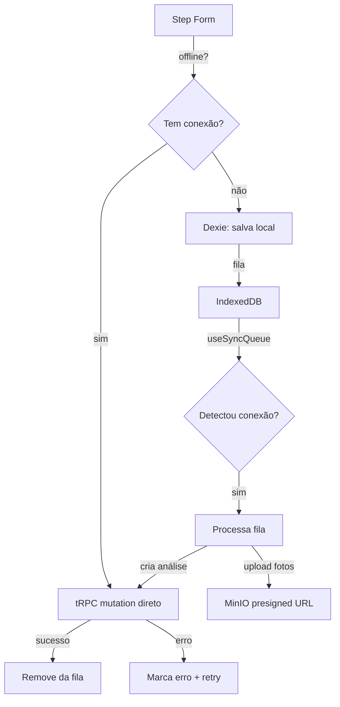

# Sincronização Offline — Design

**Spec**: `.specs/features/offline-sync/spec.md`
**Status**: Approved

---

## Architecture Overview

Camada offline baseada em IndexedDB (via Dexie.js) para armazenar análises e fotos localmente. TanStack Query gerencia o estado de sync com flags de "pending" no cache local. Um hook `useSyncQueue` detecta reconexão e processa a fila.



---

## Code Reuse Analysis

### Existing Components to Leverage

| Component | Location | How to Use |
|-----------|----------|------------|
| Step form de análise | `src/app/(dashboard)/clients/[id]/analyses/new/` | Adaptar pra funcionar com storage local |
| tRPC analysis router | `src/server/api/routers/analysis.ts` | Mesmas mutations, chamadas pelo sync |
| tRPC photo router | `src/server/api/routers/photo.ts` | Upload de fotos via presigned URL |
| MinIO client | `src/server/storage/minio.ts` | Upload de fotos sincronizadas |
| toast (sonner) | `sonner` | Feedback de sync |

### Integration Points

| System | Integration Method |
|--------|--------------------|
| Dexie.js | `dexie` npm package — wrapper IndexedDB |
| navigator.onLine | Detecção de conexão |
| online/offline events | `window.addEventListener('online', ...)` |
| TanStack Query | Cache invalidation pós-sync |

---

## Components

### src/lib/offline/db.ts — Banco local (Dexie)

- **Purpose**: Schema do IndexedDB para armazenar análises e fotos offline
- **Tables**:
  ```typescript
  // Análises pendentes
  pendingAnalyses: ++id, clientId, title, visitDate, description, status, createdAt, syncedAt, error

  // Fotos pendentes (vinculadas à análise local)
  pendingPhotos: ++id, pendingAnalysisId, blob, description, order, status
  ```
- **Status values**: `"pending"` | `"syncing"` | `"synced"` | `"error"`

### src/lib/offline/sync-queue.ts — Fila de sincronização

- **Purpose**: Orquestra a sincronização de análises pendentes
- **Functions**:
  ```typescript
  // Adiciona análise + fotos na fila local
  enqueueAnalysis(data: CreateAnalysisInput, photos: PhotoBlob[]): Promise<LocalAnalysis>

  // Processa toda a fila pendente (chamado ao reconectar)
  processQueue(): Promise<SyncResult>

  // Retry de itens com erro
  retryFailed(): Promise<SyncResult>

  // Conta pendentes
  getPendingCount(): Promise<number>
  ```

### src/hooks/use-sync-status.ts — Hook de status

- **Purpose**: React hook que monitora status de sync e conexão
- **Returns**:
  ```typescript
  {
    isOnline: boolean
    pendingCount: number
    syncingCount: number
    errorCount: number
    isSyncing: boolean
    lastSyncAt: Date | null
    retryFailed: () => void
  }
  ```

### src/hooks/use-offline-analysis.ts — Hook para criar análise offline

- **Purpose**: Abstração que decide se salva local ou envia pro servidor
- **Behavior**:
  ```typescript
  // Se online → tRPC mutation normal
  // Se offline → salva no IndexedDB via sync-queue
  function saveAnalysis(data: CreateAnalysisInput, photos: File[]): Promise<void>
  ```

### src/components/sync/sync-banner.tsx — Banner de pendências

- **Purpose**: Banner no dashboard mostrando análises pendentes
- **Location**: Renderizado no layout do dashboard
- **Behavior**: Exibe "X análises pendentes de sincronização" com botão "Sincronizar agora"

### src/components/sync/sync-badge.tsx — Badge por análise

- **Purpose**: Badge de status em cada card de análise
- **Variants**: `pending` (amarelo), `syncing` (azul pulsante), `synced` (verde), `error` (vermelho)

---

## Data Models

### IndexedDB (Dexie) — Local

```typescript
interface LocalAnalysis {
  id?: number              // auto-increment
  clientId: string         // FK pro cliente (existe no servidor)
  title: string
  visitDate: string
  description: string
  status: "pending" | "syncing" | "synced" | "error"
  error?: string           // mensagem de erro se falhou
  createdAt: Date
  syncedAt?: Date
}

interface LocalPhoto {
  id?: number
  pendingAnalysisId: number  // FK pra LocalAnalysis
  blob: Blob                 // foto em si
  description: string
  order: number
  status: "pending" | "syncing" | "synced" | "error"
}
```

### PostgreSQL — Sem mudança

Após sync, análise e fotos são criadas normalmente nas tabelas existentes.

---

## Sync Flow (detalhado)

```
1. Detectar online via navigator.onLine + evento 'online'
2. Buscar todas as LocalAnalysis com status "pending" ou "error"
3. Para cada análise:
   a. Atualizar status → "syncing"
   b. Criar análise no servidor via tRPC (title, date, description, clientId)
   c. Para cada foto local:
      - Solicitar presigned URL
      - Upload do Blob → MinIO
      - Confirmar foto no servidor
   d. Se tudo OK → status "synced", syncedAt = now
   e. Se erro → status "error", error = mensagem
4. Invalidar queries do TanStack Query (clientes, análises)
5. Toast: "X análises sincronizadas"
```

---

## Error Handling Strategy

| Error Scenario | Handling | User Impact |
|----------------|----------|-------------|
| Sem conexão ao tentar sync | Não dispara | Dados ficam locais, aguardando |
| Timeout no upload de foto (>60s) | Marca foto como erro, continua próximas | Análise parcialmente sincronizada |
| Erro ao criar análise no servidor | Marca análise como erro | Badge vermelho + botão retry |
| IndexedDB cheio | Alerta "Armazenamento local cheio" | Agrônomo precisa liberar espaço |
| Browser limpa IndexedDB | Dados perdidos — não recuperável | Alerta informativo (edge case raro) |

---

## Tech Decisions

| Decision | Choice | Rationale |
|----------|--------|-----------|
| Dexie vs raw IndexedDB | Dexie | API muito mais amigável, queries reativas, menos boilerplate |
| Blob vs base64 pra fotos | Blob | Mais eficiente em memória, não duplica tamanho |
| Sync automático vs manual | Automático com trigger manual | Automático ao reconectar, manual como fallback |
| Service Worker vs online event | online event (window) | Mais simples, Service Worker é pra PWA (outra spec) |
| Limpeza de dados sincronizados | Manter por 7 dias, depois remover | Permite verificação visual antes de limpar |
