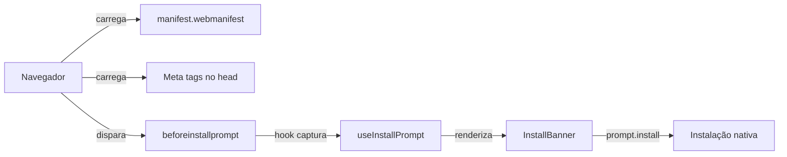

# PWA Instalável — Design

**Spec**: `.specs/features/pwa-installable/spec.md`
**Status**: Approved

---

## Architecture Overview

Configuração puramente frontend — Web App Manifest, meta tags no HTML head, e um React hook para capturar o `beforeinstallprompt` e controlar o banner de instalação customizado. Sem Service Worker complexo no MVP.



---

## Code Reuse Analysis

### Existing Components to Leverage

| Component | Location | How to Use |
|-----------|----------|------------|
| Root layout | `src/app/layout.tsx` | Adicionar meta tags e link pro manifest |
| Logo AgroAnalise | `public/` | Base para ícones PWA |
| toast (sonner) | `sonner` | Feedback pós-instalação |
| Button shadcn | `src/components/ui/button` | Botão do banner |

### Integration Points

| System | Integration Method |
|--------|--------------------|
| Web App Manifest | Arquivo estático `public/manifest.webmanifest` |
| Meta tags | Next.js metadata API no root layout |
| beforeinstallprompt | Browser API nativa |

---

## Components

### public/manifest.webmanifest

- **Purpose**: Web App Manifest para browsers reconhecerem o app como instalável
- **Content**:
  ```json
  {
    "name": "AgroAnalise — Relatórios Agronômicos",
    "short_name": "AgroAnalise",
    "description": "Crie análises visuais profissionais para seus clientes",
    "start_url": "/dashboard",
    "display": "standalone",
    "theme_color": "#18181b",
    "background_color": "#ffffff",
    "icons": [
      { "src": "/icons/icon-192.png", "sizes": "192x192", "type": "image/png" },
      { "src": "/icons/icon-512.png", "sizes": "512x512", "type": "image/png" }
    ]
  }
  ```

### public/icons/ — Ícones PWA

- `icon-192.png` — Ícone 192x192 com fundo opaco
- `icon-512.png` — Ícone 512x512 com fundo opaco
- `apple-touch-icon.png` — Ícone 180x180 para iOS (link no head)

### src/hooks/use-install-prompt.ts

- **Purpose**: Hook que captura beforeinstallprompt e gerencia estado de instalação
- **Returns**:
  ```typescript
  {
    canInstall: boolean      // true se beforeinstallprompt foi capturado
    isInstalled: boolean     // true se já está instalado (display-mode: standalone)
    promptInstall: () => Promise<void>  // dispara prompt nativo
    dismissedAt: Date | null // quando foi fechado
  }
  ```
- **Storage**: `localStorage` para persistir `dismissedAt` (não mostrar por 7 dias)

### src/components/pwa/install-banner.tsx

- **Purpose**: Banner discreto no dashboard incentivando instalação
- **Location**: Renderizado no `dashboard/page.tsx` ou layout do dashboard
- **Behavior**:
  - Android: "Instale o app" → dispara `promptInstall()`
  - iOS: "Toque em ⬆️ Compartilhar → Adicionar à Tela de Início"
  - Desktop: não renderiza
  - Fechado: salva timestamp, não mostra por 7 dias
  - Já instalado: não renderiza

### src/app/layout.tsx — Meta tags

- **Purpose**: Configurar Next.js metadata para PWA
- **Additions**:
  ```typescript
  metadata: {
    manifest: "/manifest.webmanifest",
    appleWebApp: {
      capable: true,
      statusBarStyle: "default",
      title: "AgroAnalise",
    },
    // meta theme-color já configurado pelo ThemeProvider
  }
  ```
- **Link tags**:
  ```html
  <link rel="apple-touch-icon" href="/icons/apple-touch-icon.png" />
  ```

---

## Data Models

Nenhum modelo novo. Estado de instalação gerenciado via:
- `localStorage`: `pwa_dismissed_at` (timestamp)
- `window.matchMedia('(display-mode: standalone)')`: detecta se já instalado

---

## Error Handling Strategy

| Error Scenario | Handling | User Impact |
|----------------|----------|-------------|
| beforeinstallprompt não suportado (iOS/Firefox) | Banner instrucional com steps manuais | Agrônomo segue instruções |
| Agrônomo recusa instalação | Fechar banner, não mostrar por 7 dias | Nenhum incômodo |
| Manifest não carrega | Log no console, sem crash | App funciona normalmente sem instalação |
| Ícones não encontrados | Favicon como fallback | Visual menos polido |

---

## Tech Decisions

| Decision | Choice | Rationale |
|----------|--------|-----------|
| Service Worker | Não no MVP | Offline sync já coberto pela spec offline-sync via IndexedDB. SW complexifica deploy e debug |
| Manifest estático vs dinâmico | Estático (public/) | Sem necessidade de customização por usuário na v1 |
| Ícones gerados vs manuais | Manuais (PNG) | Apenas 3 tamanhos, designer gera uma vez |
| Banner dismiss | localStorage + 7 dias | Balanceia lembrança com não-irritação |
| iOS instruções | Banner fixo diferenciado | iOS não suporta beforeinstallprompt — precisa de UX específico |
| Detecção desktop vs mobile | `use-mobile` hook existente | Já existe no projeto, reutilizar |
