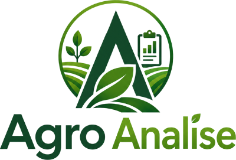
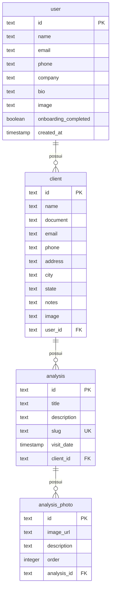

<div align="center">



**Relatórios agronômicos que impressionam.**

Documente visitas técnicas com fotos e análises, e compartilhe relatórios profissionais com seus clientes em um link.

[](https://nextjs.org/)
[](https://www.typescriptlang.org/)
[](https://trpc.io/)
[](https://orm.drizzle.team/)
[](https://betterauth.com/)
[](https://www.postgresql.org/)
[](https://tailwindcss.com/)
[](https://ui.shadcn.com/)

</div>

---

## O que é

AgroAnalise é um sistema web para **agrônomos e consultores agrícolas** que precisam registrar análises de visitas técnicas a propriedades rurais e gerar relatórios profissionais para seus clientes.

O agrônomo cadastra seus clientes, registra visitas com fotos e descrições, e compartilha um **link único** com apresentação visual premium — pronto para enviar por WhatsApp ou e-mail.

## Funcionalidades

- **Cadastro de clientes** — Nome, documento, contato, endereço, observações
- **Registro de análises** — Título, data da visita, fotos com descrições
- **Upload de fotos** — Upload direto via presigned URLs para MinIO (S3-compatible)
- **Página pública** — URL única (`/a/{slug}`) com design profissional e responsivo
- **Galeria com lightbox** — Visualização ampliada das fotos
- **Dashboard** — Métricas de clientes, análises e visitas recentes
- **Perfil do agrônomo** — Foto, telefone, empresa, bio
- **Onboarding** — Wizard de primeiro acesso para configurar o perfil
- **Landing page** — Página pública de apresentação do produto
- **Dark mode** — Suporte completo a tema claro/escuro/sistema

## Stack

| Camada | Tecnologia |
|--------|-----------|
| Framework | [Next.js 16](https://nextjs.org/) (App Router) + React 19 |
| Linguagem | TypeScript 6 (strict) |
| UI | [shadcn/ui](https://ui.shadcn.com/) + [Tailwind CSS v4](https://tailwindcss.com/) + [Lucide](https://lucide.dev/) |
| API | [tRPC v11](https://trpc.io/) + React Query v5 |
| Banco | [PostgreSQL](https://www.postgresql.org/) + [Drizzle ORM](https://orm.drizzle.team/) |
| Auth | [Better Auth](https://betterauth.com/) |
| Storage | [MinIO](https://min.io/) (S3-compatible) |
| Formulários | React Hook Form + Zod |
| Pacotes | [pnpm](https://pnpm.io/) |

## Começando

### Pré-requisitos

- Node.js 22+
- pnpm 10+
- PostgreSQL 16+
- MinIO (ou S3-compatible)

### Instalação

```bash
# Clone o repositório
git clone <repo-url> agroanalise
cd agroanalise

# Instale as dependências
pnpm install

# Configure as variáveis de ambiente
cp .env.example .env
# Edite o .env com suas credenciais
```

### Configuração

```bash
# Crie o banco de dados PostgreSQL
createdb agroanalise

# Rode as migrations
pnpm db:migrate

# (Opcional) Gere uma nova migration após mudanças no schema
pnpm db:generate

# (Opcional) Visualize o banco no Drizzle Studio
pnpm db:studio
```

### Variáveis de ambiente

```env
BETTER_AUTH_SECRET=          # Chave secreta para auth (obrigatório em produção)
DATABASE_URL=                # PostgreSQL connection string
MINIO_ENDPOINT=localhost     # Endpoint do MinIO
MINIO_PORT=9000              # Porta do MinIO
MINIO_ACCESS_KEY=minioadmin  # Access key
MINIO_SECRET_KEY=minioadmin  # Secret key
MINIO_BUCKET=agroanalise     # Nome do bucket
MINIO_USE_SSL=false          # Usar SSL?
OPENAI_API_KEY=              # API key para IA (futura feature)
```

### Desenvolvimento

```bash
pnpm dev          # Dev server com Turbopack
pnpm build        # Build de produção
pnpm preview      # Build + preview local
pnpm lint         # ESLint
pnpm typecheck    # TypeScript check
pnpm check        # Lint + Typecheck
pnpm format:write # Prettier
```

## Estrutura

```
src/
├── app/
│   ├── (auth)/              # Login e cadastro
│   ├── (dashboard)/         # Painel autenticado
│   │   ├── clients/         # CRUD de clientes + análises
│   │   ├── dashboard/       # Dashboard com métricas
│   │   └── profile/         # Perfil do agrônomo
│   ├── (onboarding)/        # Wizard de primeiro acesso
│   ├── a/[slug]/            # Visualização pública da análise
│   └── api/                 # API routes (auth, tRPC, storage proxy)
├── components/
│   ├── ui/                  # shadcn/ui (não editar diretamente)
│   ├── layout/              # AppSidebar, Header
│   ├── auth/                # LoginForm, RegisterForm
│   ├── clients/             # Componentes de clientes
│   └── landing/             # Landing page
├── server/
│   ├── api/routers/         # tRPC routers (client, analysis, photo, dashboard, user)
│   ├── better-auth/         # Better Auth config
│   ├── db/                  # Drizzle schema + conexão
│   └── storage/             # MinIO client
├── shared/schemas/          # Zod schemas compartilhados (client/server)
├── trpc/                    # tRPC setup (React provider + server caller)
├── hooks/                   # Custom hooks
└── styles/                  # Tailwind globals
```

## Banco de dados



## Documentação

| Documento | Descrição |
|-----------|-----------|
| [docs/00-visao-geral.md](docs/00-visao-geral.md) | Visão geral do sistema em linguagem acessível |
| [docs/SDD_agroanalise.md](docs/SDD_agroanalise.md) | Especificação técnica completa (SDD) |
| [docs/PROJECT_CONTROL.md](docs/PROJECT_CONTROL.md) | Controle de estado e progresso |
| [AGENTS.md](AGENTS.md) | Guia para agentes de IA |

## Roadmap

- [x] Cadastro de clientes (CRUD completo)
- [x] Registro de análises com step form
- [x] Upload de fotos via MinIO
- [x] Página pública da análise com galeria
- [x] Dashboard com métricas
- [x] Perfil do agrônomo + onboarding
- [x] Landing page
- [ ] Geração de PDF
- [ ] IA para melhoria de textos
- [ ] Testes E2E

## Licença

Projeto privado. Todos os direitos reservados.
