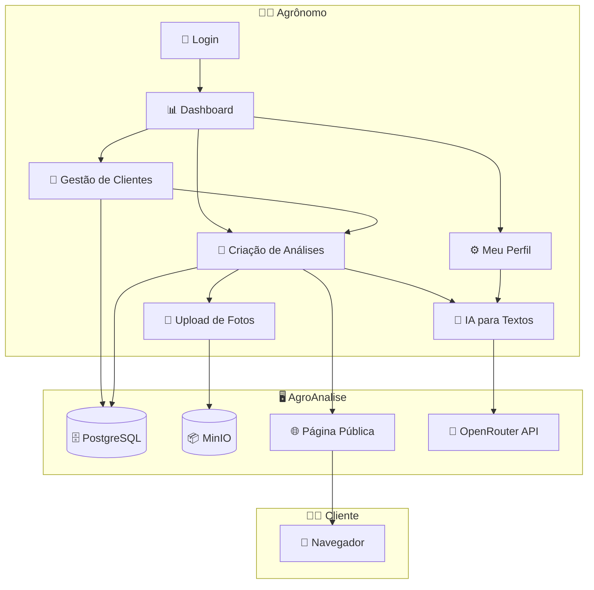

# 🌾 AgroAnalise — Visão Geral

> Plataforma para agrônomos registrarem visitas técnicas e compartilharem relatórios profissionais com clientes via link único.

## O que é o sistema

AgroAnalise é como um **portfólio digital de visitas técnicas**. O agrônomo registra cada visita a uma propriedade rural com fotos e descrições, e o sistema gera uma página bonita e profissional que pode ser compartilhada com o cliente por WhatsApp ou e-mail.

Pense nisso como o **Canva para relatórios agronômicos** — em vez de montar PDFs manualmente ou enviar fotos soltas por WhatsApp, o agrônomo usa a plataforma para criar apresentações visuais com poucos cliques.

## Como funciona na prática

1. 🧑‍🌾 O **agrônomo** faz o cadastro e configura seu perfil (nome, telefone, empresa)
2. 👨‍💼 Ele **cadastra seus clientes** (nome, documento, endereço, contato)
3. 🔬 Após uma visita técnica, ele **cria uma análise** — com título, data e fotos do local
4. 📸 Para cada foto, ele adiciona uma **descrição** do que foi observado — pode usar **IA para reescrever** com linguagem profissional
5. 🔗 Ao salvar, o sistema gera um **link único** (ex: `agroanalise.com/a/abc123`)
6. 📱 Ele **compartilha o link** com o cliente — que vê uma página profissional com todas as informações
7. 📊 No dashboard, o agrônomo acompanha **métricas** (total de clientes, análises, visitas recentes)

## Quem usa

| Perfil | O que faz no sistema |
|--------|---------------------|
| 🧑‍🌾 **Agrônomo** | Gerencia clientes, cria análises, faz upload de fotos, compartilha links, acompanha métricas |
| 👨‍💼 **Cliente** (agrônomo) | Recebe o link e visualiza a análise no navegador — sem precisar de cadastro |

> O cliente **não precisa criar conta**. Ele apenas acessa o link compartilhado pelo agrônomo.

## Módulos do sistema

| # | Módulo | O que faz |
|---|--------|----------|
| 01 | [👤 Clientes](01-clientes.md) | Cadastro e gestão de clientes |
| 02 | [🔬 Análises](02-analises.md) | Registro de visitas técnicas com fotos e descrições |
| 03 | [📸 Upload de Fotos](03-upload-fotos.md) | Envio e gerenciamento de imagens |
| 04 | [🌐 Página Pública](04-pagina-publica.md) | Visualização profissional para o cliente |
| 05 | [📊 Dashboard](05-dashboard.md) | Métricas e visão geral do trabalho |

## Regras gerais

| Regra | Detalhe |
|-------|---------|
| 🔒 Acesso ao painel | Apenas o agrônomo autenticado pode acessar o painel de gestão |
| 🌐 Acesso público | Qualquer pessoa com o link pode ver a análise (sem login) |
| 🔗 Link único | Cada análise tem um slug único (UUID) — impossível adivinhar outros links |
| 📸 Limite de fotos | Máximo de 20 fotos por análise |
| 📏 Tamanho de imagem | Máximo 10MB por foto (JPG, PNG, WebP) |
| ✍️ Descrição obrigatória | Toda foto deve ter um texto descritivo |

## Integracoes externas

| Serviço | Para que serve |
|---------|---------------|
| 🗄️ PostgreSQL | Banco de dados principal |
| 📦 MinIO | Armazenamento de imagens (compatível com Amazon S3) |
| 🤖 OpenRouter | Reescrita de textos com IA (modelo gratuito Google Gemma 3 27B) |

## Diagrama do sistema

