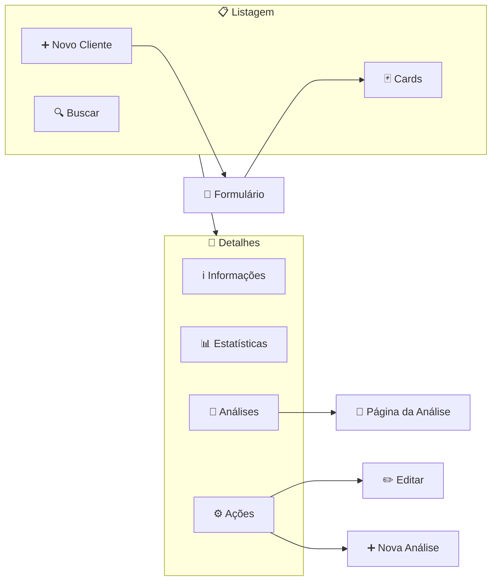

# 👤 Gestão de Clientes

> Cadastro e organização dos clientes (produtores rurais) atendidos pelo agrônomo.

## Visão Geral

O módulo de clientes é onde o agrônomo organiza sua **carteira de produtores rurais**. Cada cliente pode ter múltiplas análises associadas — funciona como uma ficha de cadastro que agrupa todo o histórico de visitas técnicas feitas naquela propriedade.

O cadastro é simples e direto: nome do produtor, documento (CPF/CNPJ), dados de contato, endereço da propriedade e observações livres.

## Como Funciona

### Listagem de clientes

O agrônomo acessa a página "Clientes" pelo menu lateral e visualiza todos os seus clientes em **cards organizados**. Cada card mostra:
- Nome do cliente
- Foto (se cadastrada)
- Total de análises realizadas
- Data da última visita

Na parte superior, há uma **barra de busca** para filtrar clientes pelo nome.

### Cadastro de cliente

Ao clicar em "Novo Cliente", abre-se um formulário com os campos:

| Campo | Obrigatório? | Detalhe |
|-------|-------------|---------|
| 📛 Nome | ✅ Sim | Nome do produtor ou empresa |
| 📄 Documento | ❌ Não | CPF ou CNPJ |
| 📧 E-mail | ❌ Não | E-mail de contato |
| 📞 Telefone | ❌ Não | Telefone/WhatsApp |
| 📍 Endereço | ❌ Não | Endereço da propriedade |
| 🏙️ Cidade | ❌ Não | Cidade |
| 🗺️ Estado | ❌ Não | UF |
| 📝 Observações | ❌ Não | Notas livres do agrônomo |
| 🖼️ Foto | ❌ Não | Foto do cliente ou propriedade |

### Página de detalhes

Ao clicar em um cliente, o agrônomo vê:
- **Informações completas** do cliente
- **Estatísticas** (total de análises, última visita, total de fotos)
- **Lista de análises** realizadas para aquele cliente
- **Ações** (editar dados, criar nova análise, ver perfil da fazenda)

## Regras Importantes

| Regra | Detalhe |
|-------|---------|
| 🔒 Dados privados | Cada agrônomo só vê seus próprios clientes |
| 🗑️ Exclusão em cascata | Ao excluir um cliente, todas as análises e fotos são removidas |
| ✏️ Edição livre | Todos os campos podem ser editados a qualquer momento |
| 📊 Contadores automáticos | Total de análises e última visita são calculados automaticamente |
| 🔍 Busca parcial | A busca filtra por nome, buscando em qualquer parte do texto |

## Quem Pode Fazer O Que

| Ação | 🧑‍🌾 Agrônomo | 👨‍💼 Cliente |
|------|-----------|-----------|
| Ver listagem de clientes | ✅ | ❌ |
| Cadastrar novo cliente | ✅ | ❌ |
| Editar dados do cliente | ✅ | ❌ |
| Excluir cliente | ✅ | ❌ |
| Ver detalhes do cliente | ✅ | ❌ |

## Perguntas Frequentes

**Posso ter dois clientes com o mesmo nome?**
Sim. Não há restrição de nome único. Use o documento (CPF/CNPJ) para diferenciar.

**O que acontece quando excluo um cliente?**
Todas as análises e fotos daquele cliente são permanentemente removidas. Não é possível desfazer. Uma confirmação é exibida antes da exclusão.

**O cliente consegue ver seus próprios dados de cadastro?**
Não. O cliente só tem acesso à página pública da análise. O cadastro é interno e visível apenas para o agrônomo.
