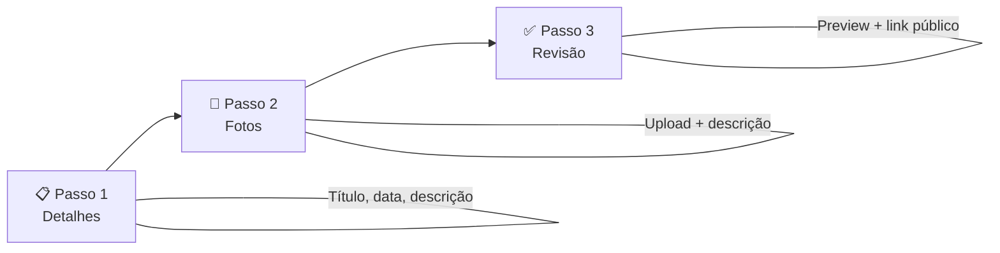

# 🔬 Análises

> Registro de visitas técnicas a propriedades rurais, com fotos e descrições organizadas.

## Visão Geral

A análise é o **coração do sistema** — é aqui que o agrônomo documenta o que observou durante uma visita técnica. Cada análise pertence a um cliente e contém um conjunto de fotos com descrições detalhadas.

O fluxo é simples: o agrônomo seleciona o cliente, cria uma análise com título e data, adiciona fotos e textos, e ao salvar o sistema gera automaticamente um **link público** para compartilhar com o cliente.

## Como Funciona

### Criando uma análise

A criação segue um **step form de 3 passos** que guia o agrônomo sequencialmente:

#### Passo 1 — Detalhes
O agrônomo preenche as informações básicas:

| Campo | Obrigatório? | Detalhe |
|-------|-------------|---------|
| 📛 Título | ✅ Sim | Nome da análise (ex: "Análise de solo - Talhão Norte") |
| 📅 Data da visita | ✅ Sim | Quando a visita foi realizada |
| 📝 Descrição | ❌ Não | Texto geral sobre a visita |

#### Passo 2 — Fotos
O agrônomo adiciona as fotos da visita:
- **Upload** de uma ou mais fotos (arrastar ou clicar)
- **Descrição** obrigatória para cada foto
- **Ordenação** das fotos (arrastar para reordenar)
- **Remoção** individual de fotos

#### Passo 3 — Revisão
Tela de confirmação com:
- Preview de todas as fotos e descrições
- **Link público** gerado automaticamente
- Botão para copiar o link
- Botão para compartilhar

### Editando uma análise

O agrônomo pode editar uma análise a qualquer momento — alterar título, data, descrição, adicionar ou remover fotos. O link público permanece o mesmo após a edição.

### Listagem de análises

Na página de detalhes do cliente, todas as análises são listadas em cards com:
- Título da análise
- Data da visita
- Thumbnail da primeira foto
- Total de fotos

## Regras Importantes

| Regra | Detalhe |
|-------|---------|
| 🔗 Link automático | Ao criar a análise, um slug único (UUID) é gerado automaticamente |
| 🌐 Pública após salvar | A análise fica acessível pelo link público assim que é salva — sem conceito de rascunho |
| 📸 Máximo de fotos | 20 fotos por análise |
| 📏 Tamanho por foto | Máximo 10MB (JPG, PNG, WebP) |
| ✍️ Descrição obrigatória | Toda foto precisa de um texto descritivo |
| 🔄 Link fixo | Editar a análise não muda o link público |
| 🗑️ Exclusão em cascata | Excluir uma análise remove todas as fotos associadas |

## Quem Pode Fazer O Que

| Ação | 🧑‍🌾 Agrônomo | 👨‍💼 Cliente |
|------|-----------|-----------|
| Criar análise | ✅ | ❌ |
| Editar análise | ✅ | ❌ |
| Excluir análise | ✅ | ❌ |
| Ver análise no painel | ✅ | ❌ |
| Ver análise pelo link público | ✅ | ✅ |
| Copiar link de compartilhamento | ✅ | ❌ |

## Perguntas Frequentes

**Posso criar uma análise sem fotos?**
Não. O step form exige pelo menos uma foto com descrição para concluir.

**O cliente recebe notificação quando uma análise é criada?**
Não. O agrônomo precisa compartilhar o link manualmente (WhatsApp, e-mail, etc).

**Se eu editar uma análise, o link muda?**
Não. O link público é fixo — baseado no slug gerado na criação. Edições apenas atualizam o conteúdo.

**Posso ter duas análises com o mesmo título para o mesmo cliente?**
Sim. O título não é único. A diferenciação é feita pelo ID e data da visita.
