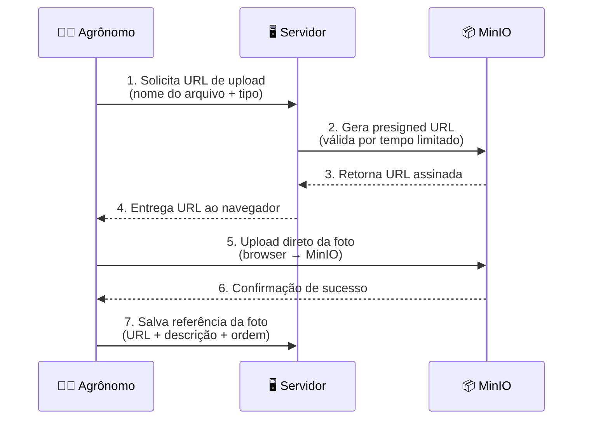

# 📸 Upload de Fotos

> Envio, armazenamento e gerenciamento de imagens das análises.

## Visão Geral

As fotos são a parte mais importante de uma análise — são elas que mostram ao cliente o que foi observado na visita técnica. O sistema usa o **MinIO** (compatível com Amazon S3) para armazenar as imagens de forma segura e escalável.

O upload é feito diretamente do navegador do agrônomo para o MinIO, sem passar pelo servidor da aplicação. Isso garante **velocidade e eficiência** — o servidor apenas coordena o processo gerando URLs assinadas temporárias.

## Como Funciona

### Fluxo de upload

### Detalhes do processo

1. **Solicitação** — O agrônomo seleciona uma foto no formulário de análise
2. **URL assinada** — O servidor gera uma URL temporária com permissão de escrita no MinIO
3. **Upload direto** — O navegador envia a foto direto para o MinIO (sem pesar o servidor)
4. **Registro** — O sistema salva a referência da foto (URL, descrição, ordem) no banco de dados

### Tipos de uso

| Tipo | Pasta no MinIO | Finalidade |
|------|---------------|------------|
| 🔬 Análise | `photos/{userId}/{uuid}-{filename}` | Fotos das visitas técnicas |
| 🧑 Avatar | `avatars/{userId}/{uuid}-{filename}` | Foto de perfil do agrônomo |

## Regras Importantes

| Regra | Detalhe |
|-------|---------|
| 📏 Tamanho máximo | 10MB por imagem |
| 🖼️ Formatos aceitos | JPG, PNG, WebP |
| 📸 Limite por análise | 20 fotos |
| 🔒 URL assinada | URLs de upload são temporárias e expiram |
| 🗂️ Organização | Fotos organizadas por usuário e UUID único |
| 🧹 Limpeza automática | Fotos removidas de uma análise são excluídas do MinIO |
| 🖼️ Preview | O navegador mostra preview da foto antes do upload |

## Quem Pode Fazer O Que

| Ação | 🧑‍🌾 Agrônomo | 👨‍💼 Cliente |
|------|-----------|-----------|
| Fazer upload de fotos | ✅ | ❌ |
| Ver fotos no painel | ✅ | ❌ |
| Ver fotos na página pública | ✅ | ✅ |
| Remover foto de análise | ✅ | ❌ |
| Reordenar fotos | ✅ | ❌ |

## Perguntas Frequentes

**Para onde as fotos vão?**
As fotos são armazenadas no MinIO, um servidor de armazenamento compatível com Amazon S3. Elas não ficam no banco de dados — apenas a referência (URL) é salva no banco.

**Posso arrastar várias fotos de uma vez?**
Sim. O campo de upload aceita seleção múltipla. Cada foto será adicionada individualmente com seu próprio campo de descrição.

**Se eu remover uma foto, ela volta?**
Não. A remoção é permanente — a foto é excluída do MinIO e a referência é removida do banco.

**O que acontece se o upload falhar?**
O sistema exibe uma mensagem de erro com opção de tentar novamente (retry manual). Fotos com falha não são salvas na análise.
