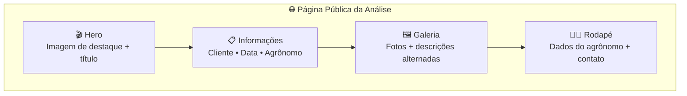

# 🌐 Página Pública

> A apresentação profissional da análise que o cliente recebe via link.

## Visão Geral

A página pública é o que o **cliente (produtor rural) vê** quando acessa o link compartilhado pelo agrônomo. É uma página com design premium, responsiva e sem necessidade de login — pensada para impressionar e comunicar claramente os resultados da visita técnica.

A URL segue o formato `agroanalise.com/a/{slug}`, onde o slug é um UUID único gerado automaticamente.

## Como Funciona

### Layout da página

### Seções da página

| Seção | Conteúdo |
|-------|----------|
| 🎬 **Hero** | Imagem de destaque (primeira foto), título da análise, data da visita |
| 📋 **Informações** | Nome do cliente, nome do agrônomo, telefone, empresa |
| 🖼️ **Galeria** | Cada foto com sua descrição — layout alternado (foto esquerda/texto direita, depois inverte) |
| 🔍 **Lightbox** | Ao clicar em uma foto, ela abre ampliada em overlay escuro |
| 🧑‍🌾 **Rodapé** | Foto do agrônomo, nome, empresa, telefone, e-mail |

### Responsividade

| Dispositivo | Layout |
|-------------|--------|
| 📱 Mobile | Fotos empilhadas verticalmente, uma por vez |
| 💻 Desktop | Layout alternado — foto e descrição lado a lado |

### Acesso

- **Sem login** — qualquer pessoa com o link acessa diretamente
- **Link único** — slug UUID não-sequencial (impossível adivinhar outros links)
- **Metadados OG** — ao compartilhar no WhatsApp, mostra preview com título, imagem e descrição

## Regras Importantes

| Regra | Detalhe |
|-------|---------|
| 🔓 Sem autenticação | A página é 100% pública — não requer login |
| 🔗 Link permanente | O link não expira — funciona enquanto a análise existir |
| 🤖 SEO otimizado | Metadados Open Graph para previews em redes sociais e WhatsApp |
| 📱 Mobile-first | Design pensado primeiro para celular (onde o cliente mais vai acessar) |
| ⚡ Performance | Imagens otimizadas com Next.js Image, carregamento lazy |

## Quem Pode Fazer O Que

| Ação | 🧑‍🌾 Agrônomo | 👨‍💼 Cliente | 🌍 Visitante |
|------|-----------|-----------|-------------|
| Acessar pelo link | ✅ | ✅ | ✅ |
| Ver fotos e descrições | ✅ | ✅ | ✅ |
| Abrir lightbox | ✅ | ✅ | ✅ |
| Copiar o link | ✅ | ✅ | ✅ |
| Editar a análise | ❌ (via painel) | ❌ | ❌ |
| Baixar fotos | ✅ | ✅ | ✅ |

## Perguntas Frequentes

**O link da análise expira?**
Não. O link funciona indefinidamente — enquanto a análise existir e não for excluída, qualquer pessoa com o link pode acessar.

**Posso proteger a análise com senha?**
Na versão atual, não. O acesso é exclusivamente pelo link. Como o slug é um UUID, é praticamente impossível adivinhar links de outras análises.

**O que o cliente vê ao abrir o link no WhatsApp?**
O WhatsApp mostra um preview com o logo do AgroAnalise, título da análise e descrição — graças aos metadados Open Graph configurados na página.

**Se eu excluir a análise, o link para de funcionar?**
Sim. Ao excluir uma análise, a página pública deixa de existir e o link mostra um erro 404.
